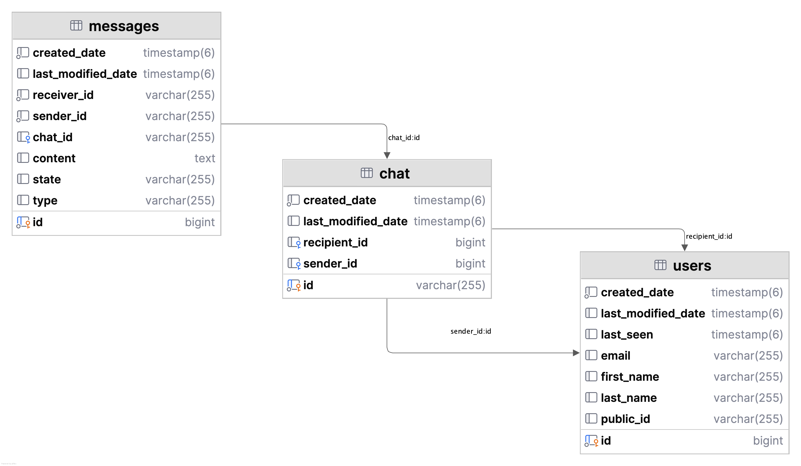

# WhatsApp Clone Backend

## Overview
This project is a backend implementation of a WhatsApp-like messaging application built using **Spring Boot**. It provides core functionalities such as user management, real-time chat, messaging, file handling, and notifications, secured with **Keycloak** for authentication and authorization. The backend leverages WebSocket for real-time communication and includes OpenAPI documentation for API exploration.




## Features
- **User Management**: Synchronized with Keycloak for secure authentication and authorization.
- **Real-Time Chat**: Supports group and individual chats using WebSocket.
- **Message Handling**: Enables sending, receiving, and storing messages.
- **File Service**: Handles file uploads and downloads.
- **Notification Service**: Sends real-time notifications to users.
- **OpenAPI Integration**: Provides API documentation for easy interaction with endpoints.
- **Database**: Utilizes JPA with named queries for efficient data access.
- **Security**: Implements robust security configurations using Keycloak.


## Prerequisites
To run this project, ensure the following are installed:
- **Java**: Version 17 or higher
- **Maven**: For dependency management and building the project
- **Keycloak**: For authentication and authorization
- **Database**: A relational database (e.g., PostgreSQL or MySQL)
- **IDE**: IntelliJ IDEA, Eclipse, or any IDE with Spring Boot support

## Setup Instructions
1. **Clone the Repository**:
   ```bash
   git clone <repository-url>
   cd whatsapp-clone-backend
   ```

2. **Configure Keycloak**:
    - Set up a Keycloak server (refer to [Keycloak documentation](https://www.keycloak.org/docs/latest/server_installation/)).
    - Create a realm and configure clients, roles, and users as needed.
    - Update the `application.properties` file with Keycloak server details:
      ```properties
      spring.security.oauth2.client.provider.keycloak.issuer-uri=<keycloak-issuer-uri>
      ```

3. **Database Configuration**:
    - Configure your database in `application.properties`:
      ```properties
      spring.datasource.url=jdbc:postgresql://localhost:5432/whatsapp_clone
      spring.datasource.username=<username>
      spring.datasource.password=<password>
      spring.jpa.hibernate.ddl-auto=update
      ```

4. **Build and Run**:
   ```bash
   mvn clean install
   mvn spring-boot:run
   ```

5. **Access OpenAPI Documentation**:
    - Once the application is running, access the OpenAPI UI at `http://localhost:8080/swagger-ui.html`.

## Usage
- **Authentication**: Use Keycloak to authenticate users via OAuth2.
- **APIs**: Interact with the backend using RESTful endpoints documented in the OpenAPI specification.
- **Real-Time Features**: Connect to WebSocket endpoints for real-time chat and notifications.
- **File Handling**: Use the file service endpoints to upload and download files.

## Testing
The backend has been thoroughly tested for functionality, security, and performance. To run tests:
```bash
mvn test
```

## Contributing
Contributions are welcome! Please follow these steps:
1. Fork the repository.
2. Create a new branch (`git checkout -b feature-branch`).
3. Commit your changes (`git commit -m 'Add feature'`).
4. Push to the branch (`git push origin feature-branch`).
5. Create a pull request.

## License
This project is licensed under the MIT License. See the [LICENSE](LICENSE) file for details.

